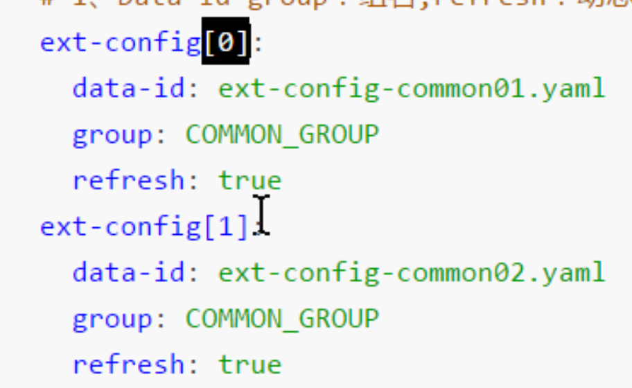

可以通过添加`nacos-config`依赖，然后配置`bootstrap.yaml`来实现从云端读取配置。
```java
@Value("${common.name}")  
private String common_name;  
  
@GetMapping("/common_name_value")  
public String getCommon_name(){  
    return common_name;  
}  
  
@Autowired  
ConfigurableApplicationContext appicationContext;  
  
@GetMapping("/common_name_applicationContext")  
public String getValue(){  
    return appicationContext.getEnvironment().getProperty("common.name");  
}
```

```yml
spring:  
  application:  
    name: nacos-restful-consumer  
  cloud:
      # 指定配置中心的地址
      config:  
        server-addr: 127.0.0.1:8848  
        namespace: 819f148d-e740-4884-a57d-77fe548ba3e3  
        file-extension: yaml
```

```xml
<!-- 配置中心 -->  
<dependency>  
    <groupId>com.alibaba.cloud</groupId>  
    <artifactId>spring-cloud-starter-alibaba-nacos-config</artifactId>  
</dependency>
```
要注意：
- 在bootstrap.yml中只需要指定文件的名称即可，系统会通过`spring.application.name`+`spring.cloud.config.file-extension`的方式来找到配置文件
- 在程序代码中可以使用`@Value`直接读取Nacos云端配置，但是如果这时候云端配置发生了变化，那么`@Value`指定的值是不会发生改变的，因此不建议使用`@Value("${xxx.xxx}")`的方式。


# 扩展配置文件
使用`ext-config[x]:`数组的方式进行扩展：
- 请注意：若是元素重复，那么以主配置文件优先
- 若是有多个扩展配置文件，那么数组的下标越大，优先级越高（仅看`bootstrap.yml`中的）
- 下标必须从0开始
```yml
spring:  
  application:  
    name: nacos-restful-consumer  
  
  cloud:  
    nacos:  
      config:  
        server-addr: 127.0.0.1:8848  
        namespace: 819f148d-e740-4884-a57d-77fe548ba3e3  
        file-extension: yaml  
        ext-config[0]:  
          data-id: ext-config-common01.yaml  
          group: COMMON_GROUP  
          refresh: true  
        ext-config[1]:  
          data-id: ext-config-common02.yaml  
          group: COMMON_GROUP  
          refresh: true
```

```java
@GetMapping("/commons1")  
public String Conmons1(){  
    String name = appicationContext.getEnvironment().getProperty("common.name");  
    String addr = appicationContext.getEnvironment().getProperty("common.addr");  
    System.out.println(name+":"+addr);  
    return name+":"+addr;  
}  
  
@GetMapping("/commons2")  
public String Conmons2(){  
    String name = appicationContext.getEnvironment().getProperty("common.name");  
    String addr = appicationContext.getEnvironment().getProperty("common.addr");  
    System.out.println(name+":"+addr);  
    return name+":"+addr;  
}
```

`application1 config edit:shanghai`




