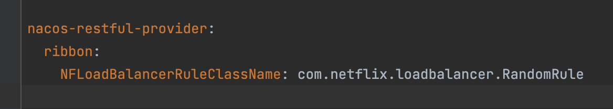

# LoadBalance的特点
> Ribbon核心组件IRule是负载均衡策略接口，它有如下实现，大家仅做了解：

- RoundRobinRule(默认);轮询，即按一定的顺序轮换获取实例的地址。
-   RandomRule:随机，即以随机的方式获取实例的地址。
-   AvailabilitvFilteringRule：会先过滤掉由于多次访问故障而处于断路器跳闸状态的服务，以及并发的连接数量超过國值的服务,然后对剩余的服务列表按照轮询策略进行访问;
-   WeightedResponseTimeRule:
	- 根据平均响应时间计算所有服务的权重,响应时间越快,服务权重越大,被选中的机率越高;  
	- 刚启动时,如果統计信息不足,则使用RoundRobinRule策略,等统计信息足够时,会切换到 WeightedResponseTimeRule
-   RetryRule：先按照RoundRobinRule的策略获取服务,如果获取服务失败,则在指定时间内会进行重试,获取可用的服务；  
- BestAvailableRule：会先过滤掉由于多次访问故障而处于断路器跳闸状态的服务,然后选择一个并发量最小的服务;
-   ZoneAvoidanceRule：默认规则,复合判断server所在区域的性能和server的可用性选择服务器;

# 启动多个项目的方法


# 更换LoadBalance负载均衡机制
```yml
nacos-restful-provider:  # 服务名称 
  ribbon:  
    NFLoadBalancerRuleClassName: com.netflix.loadbalancer.RandomRule # 负载均衡算法的位置
```

